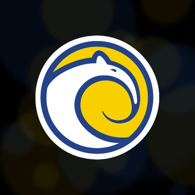
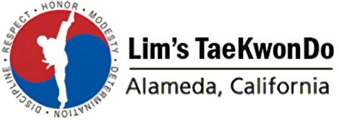

## Amyris, Inc (June 2021 - September 2021) | Desktop Support Analyst Intern

I am currently a desktop support analyst intern for [Amyris, Inc](https://amyris.com/), which is a SF Bay Area based biotech company that aims to lead the world to a more sustainable future. Amyris brands include the beauty brands Biossance, Costa Brazil, and EcoFabulous, the personal care brand Pipette, and the sweetener brand Purecane. Amyris is pioneering the future of clean chemistry and synthetic biology while keeping true to their core values of Collaboration, Amorous, Innovation, Safety, and Integrity.

At Amyris, Inc, I am part of a small yet efficient team of IT professionals who work tirelessly to **deploy and maintain critical infrastructure** of the company. This includes things such as: workstations and peripherals, A/V equipment and communication devices, the company intranet and VPN, network switches and data servers, in-house as well as licensed software, and more. Given that there are experiments, testing, and processing done 24 hours a day, 7 days a week, it is imperative that there be exceedingly minimal amounts of downtime or errors in any of our domains. Furthermore, we have employees spread out around the globe including places such as the East Coast and Brazil, which means that competence in **remote collaboration and communication** is essential. Personally as a desktop support analyst, I am charged with running the **IT helpdesk** of the company, tasks of which include things such as **troubleshooting** both hardware and software issues, as well as a considerable amount of **system administration**. **Imaging and deployment of workstations** is also one of my primary responsibilities, as the company is growing exponentially as of time of writing. As I have just started in this position, I am looking into projects involving the company's cybersecurity practices in order to better help protect the valuable and sensitive data the company produces each day.

I am very grateful for the opportunity to work at a company such as Amyris, Inc. Their mission for a sustainable future through clean chemistry is extremely admirable and something that I am proud to be a part of. We only have one Earth after all, so we should do our best to take care of it. As for the position itself, I gain great satisfaction in helping others with their technical issues, and having the responsibility of maintaining the IT infrastructure of such a large and growing company is very humbling. After all, there are only about 8 people in the entire IT department including myself, and there are over 800 employees in the company. This number is expected to double within the next few months as well, so the significance of my job will continue to grow. Overall, I hope I continue to mature as a working professional and learn a lot more during my time here.

## Stensal, Inc (October 2019 - June 2020) | Frontend Engineer & Publicity Manager

I am a former frontend engineer and publicity manager at [Stensal, Inc](https://stensal.com), which is a SF Bay Area based startup that has developed a revolutionary tool to diagnose Segmentation Fault (segfault) errors in programs written in C/C++. The tool is wrapped in a fully functional cloud IDE, in which users can easily create, compile, and execute their programs. Upon encountering a segfault, the built-in console displays an extremely comprehensive and actionable message detailing what caused the error, and where it lies in the code.

At Stensal, Inc, I had a double role of being both a frontend engineer as well as a publicity manager. Due to having an extremely small team size of less than 15 people, I stepped into these roles in order to help grow and improve the company and its product. As a frontend engineer, I was responsible for creating **functional, aesthetic UI/UX** for the tool, utilizing pure **Javascript, HTML, and CSS**. This included processing user feedback and following industry standards and innovations in order to create the ultimate **user-oriented product**, while **maintaining efficiency and security**. As a publicity manager, I was also responsible for spreading the word about the product and increasing the number of users the tool receives. This was achieved by utilizing modern-day channels such as **Reddit** and **online advertising**, as well as direct means such as **word of mouth**. Thanks to my efforts, Stensal, Inc has developed substantially, and its product offers more features and ease-of-use than ever before. More and more users have begun to make use of the tool as well, and the company has big plans for the future coming up.

Working at Stensal, Inc was my very first foray into the tech industry, and I had an incredible time. Although the position was remote and I missed out on a lot of the social aspects of working, I still found the overall experience to be extremely valuable to me. Working there allowed me to get a feel for what real-world industry software engineering and development is like, which definitely helped prepare me for when I started working post-graduation. Not to mention I learned so much about good engineering and development practices, and I really honed my coding skills as well. I also developed better communication skills as a result of my publicity efforts, which translates into many other things in life and will help me down the line too. Overall, this experience was incredibly rewarding and productive for me, and I'm all the better for it.

## Canvas (April 2019 - January 2020) | Growth Marketing Intern

I am a former growth marketing intern for [Canvas](https://www.canvas.com/), which is a diverse platform of engineering and computer science students and companies that hire them. It serves as both a social networking platform for students to connect with each other as well as a hiring platform for the affiliated companies to acquire new talent for internship and full-time positions.

At Canvas, my role was basically that of a **community ambassador**, someone who is responsible for enabling and contributing to the growth of the platform through traditional and modern outreach techniques. As a growth marketing intern at UCI, I have done much to spread Canvas's presence on campus and within the UCI community. I have maintained an active presence on online forums and have introduced many of my peers to Canvas both through those forums as well as in person. I have also participated in discussion with company representatives about how to improve the platform as well as how to gain and retain more users. Thanks to my efforts and the efforts of my fellow interns and coworkers, Canvas has over **40,000 active users** at the time of writing, and that number continues to grow each day.

I was really grateful for the opportunity to work at Canvas. The platform has truly grown by leaps and bounds since I've joined, and I am proud of what an incredible community the platform has managed to foster. Its in-house forums are always bustling with activity, and users, who were students just like me, are all so positive and supportive of each other. I believe my experience here has really enabled me to learn more about the kind of work culture I prefer and thrive in, and I hope that I too will continue to learn and grow alongside Canvas itself.

## UCI Esports Arena (April 2018 - June 2020) | Student Staff

I formerly worked at the [UCI Esports Arena](https://esports.uci.edu/arena/), which is a public gaming hub located on the UCI campus that provides top-of-the-line desktop computers preloaded with all the latest, most popular games for guests to use for an hourly fee. UCI is one of the leaders in promoting collegiate and scholastic gaming, and the Esports Arena is just one of the many accomplishments of the university's Esports program.

My role as a member of the student staff force was to ensure guests at the Arena enjoy their time at the establishment to the fullest, and have an overall fun and comfortable experience. I was responsible for processing and logging all **monetary transactions** at the Arena, which consists of customers purchasing hours to use the computers. I was also in charge of maintaining Arena **cleanliness and orderliness**; maintaining a clean environment is not only a matter of professionalism but safety as well. Furthermore, I was responsible for **providing technical support** and troubleshooting help for any issues that arise with the equipment, have it be the computers, systems, or other equipment such as consoles or TVs. Additionally, when there are events such as meetings, tournaments, or parties hosted at the Arena, I was in charge of **event execution**; making sure all events run smoothly and on time is of major importance.

My experience working at the Arena has immensely developed my skills as a member of a team. Not only have my interpersonal and communication skills grown considerably, I have also become highly proficient in being able to juggle many different tasks at a time and complete them all within a reasonable amount of time based upon priority. I have also learned a considerable amount about collegiate gaming, which I believe has the potential to grow into a major facet of the overarching "university experience" within the US, as well as around the world.

## Lim's Taekwondo (August 2015 - July 2017) | Assistant Instructor

*Lim's Taekwondo* is a taekwondo studio located in Alameda, California. It is run by grandmaster Chris Lim, a Kukkiwon certified 8th degree black belt and extremely prestigious member of the global taekwondo community. The studio provides Olympic-style taekwondo classes for all age groups, from youth to teens to adults, and emphasizes the development of discipline, respect, honor, and health.

Before leaving for university, I was an instructor at *Lim's Taekwondo*. As a **3rd degree black belt** and **decorated competitor**, I had the skills and knowledge to be an instructor and lead classes on my own. I was responsible for leading mainly the youth classes, which consisted of anywhere between **10 - 30 students** on average, all around elementary and middle school age. During class, I would lead the students as a group in warmup exercises at first, then move on to more strenuous exercises and technique practice. For the full hour that classes would last for, I would focus on giving each student adequate amounts of personal help and making sure that everyone was not only participating and doing their best, but having a good time.

Working as an instructor definitely boosted my interpersonal and communication skills, as that was a good 90% of the entire job. It was also my first experience working for a company rather than being self-employed, which was essential in developing my work ethic and responsibility as an employee. I believe that my time working in this position was a positive and ideal first step into the working world, as I have grown considerably thanks to it.

## Private Tutor (January 2013 - July 2017) | Self Employed

My very first experience having any sort of job whatsoever was as a private tutor while I was in high school. When I was younger, I really excelled in school and always got top marks, so I figured I could put some of that knowledge to use as a tutor. I already knew a couple of people parents who were interested in finding some extra academic help for their elementary or middle schoolers, so I offered my services and began to tutor them.

I would have one-on-one sessions with each student, usually for about an hour or so after school, where I would help them with homework and go over classwork from the day that they may have had some trouble with. The subjects were all encompassing; I tutored **English**, **math**, **science**, and **social studies**. I would also formulate simple practice exercises to complement their homework so that they could get extra experience in concepts they were having trouble with. Other than being there to help with academics, I also indirectly served as a sort of "older brother" figure to many of my students, as I was constantly trying to set a proper example for them in terms of **responsibility**, **discipline**, and **work ethic**. As a result of my efforts (and theirs too of course), all of my students were able to improve their grades and understanding of their school subjects.

As the same is with many others, my first job was an incredible learning experience that really introduced me to what "having a job" entails: responsibilities, expectations, dedication, and of course hard work. I was also able to develop my interpersonal and communication skills, as well as skills needed to be a good teacher. Tutoring has made me realize that teaching someone else how to do something is one of the best ways to learn even more, and I try to pursue that ideal even today with my own coursework.

[Go to the Home Page]({{ site.url }}{{ site.baseurl }})
